HW3 Virtual Memory Experiment
=============================

.. contents:: Table of Contents

Overview
--------
In this homework, we will carry two experiments to observe how shared memory works in Linux and understand the virtual memory subsystem.

On Linux, the virtual memory subsystem is implemented in the OS kernel. To obtain the information such as the mapping of physical memory frames for a process, we will need access to data structures maintained by the kernel. Specifically, we will add a Linux system call to translate virtual address to physical address. (Section 4 Part A)

Then, you will write two userspace programs to carry out the experiments. (Section 4 Part B, C)

To help you with this homework, we also provide 3 tutorial sections (Section 1~3).

- In Section 1, we will show how to get the process memory layout via procfs.
  We also also demonstrate how shared libraries are structured in the memory layout by creating a simple shared library.

- In Section 2, we will show how to add a system call to linux kernel.

- In Section 3, we will present the x86_64 address translation process and point out the page table data structure implementations in the linux kernel.

If you already have some idea on these, you can directly jump to Section 4 for the homework assignment.

Section 1. Process Memory Layout
--------------------------------

In Section 1, we will discuss about how process uses memory and introduce some tools for observing it.

A. Basic Process Memory Layout
~~~~~~~~~~~~~~~~~~~~~~~~~~~~~~~~~~~

Basically, the memory of a process can be divided into 4 parts. 

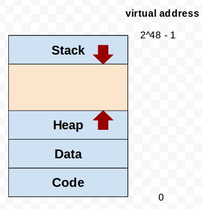

   **Figure 1. basic memory layout of a process**

1. Code segment, which stores the code of the program except shared libraries.
2. Data segment, which stores global and static variables except shared libraries.
3. Stack segment, which stores local variables including function parameters. It is also know as the call stack.
4. Heap segment, which is used for dynamic memory allocation(malloc/free).

In current linux implemetation(Linux 3.x & 4.x), each segment should be a contiguous memory block in **virtual address space**.
In a real-world system such as Linux, there may be multiple segments for each type of segment.

Different segments may carry different permissions. For instance, data segments usually do not allow code execution (i.e. Data Execution Prevention).

B. Process Memory Layout in Linux
~~~~~~~~~~~~~~~~~~~~~~~~~~~~~~~~~

Figure 2 shows the virtual memory layout of a process in 32 bits Linux system. 

.. figure:: pic/linuxFlexibleAddressSpaceLayout.png

   **Figure 2. 32 bits Linux process memory layout**

In Figure 2. 

1. Text segment corresponds to the code segment as in the basic process memory layout.
2. Data and bss segment corresponds to the data segments, where bss segment stores uninitialized global variable.
3. Heap segment and stack segment are idential that in the basic process memory layout.
4. Memory mapping segment consists of many segments, which is usually used for shared libraries' code and data segment. [3]_
5. ``RLIMIT_STACK`` is the maximum size of stack. If stack size is larger than that, stack overflow will occur. you can use ``ulimit`` to control ``RLIMIT_STACK`` for each user in Linux.
6. Random offset is a security policy called ASLR(Address Space Layout Randomization). We won't discuss it in this HW.

Part of the program code of a process may exist in library forms. Static libraries are linked into the executable at compilation time while shared libraries are loaded at runtime [2]. As we will see in the homework, a shared library can be shred by multiple processes. That is why they are called "shared" libraries.

Also because shared libraries are seperate from the main executable, they have independent code and data segments.

C. Process Memory Layout of Real Process in Linux (using procfs to observe)
~~~~~~~~~~~~~~~~~~~~~~~~~~~~~~~~~~~~~~~~~~~~~~~~~~~~~~~~~~~~~~~~~~~~~~~~~~~

We will run a simple program and observe its memory layout.

1. compile and run the first program in C

   ::

     $ cd Section1/
     $ make
     $ ./hello.out

2. get the process id of our program

   ::
    
     # <Ctrl-Z> to suspend program, so you can run another command.
     # dump the process snapshot(ps), and find the pid of our process (grep by process name)

     $ ps aux | grep hello
     <username> 7657  0.0  0.0   4204   648 pts/14   T    05:44   0:00 ./hello.out
     # 7657 is the pid of process

     # the shortcut command
     $ pgrep hello

3. find process virtual memory layout in the procfs

   ::

     $ cat /proc/<pid>/maps  # e.g. cat /proc/1234/maps

     # if the layout is more than one page, we can use less pager
     $ cat /proc/<pid>/maps | less

   .. figure:: pic/procfs_map_hello.png
      :scale: 50%

      **Figure 3. process memory layout of hello program**

4. read the layout.

   Each line of the layout corresponds to a VMA (Virtual Memory Area).

   VMA is very similar thing to the concept of "segments" in linux kernel implementation.

   VMA is a contiguous range of virtual addresses that have the same permission flags.

   The fields in each line are::
   
       start-end perm offset major:minor inode image

       e.g.
       00400000-00401000 r-xp 00000000 08:06 2490469 /home/susu/workspace/2015_OS_hw3/partA/hello.out
     
   - ``start``, ``end``
    
      The beginning and ending virtual addresses for this memory area.

   - ``perm(permission)``

      read, write, execute permission for this virtual memory area, just like linux file system permission.
   
   - ``inode``, ``image``, ``offset``

      If there is a file mapping to this VMA (sometimes caused by ``mmap`` syscall), these value are about the mapped file.
      File's inode, file path, and the starting file offset mapping to this memory.

      ``man mmap`` for more infomation.
     
   - ``major``, ``minor``

      device number [4]_ for device holding memory mapped file. This is not discussed in this HW.

   a. First, find the process name. it can point you to the code and data segments of your program.
      Code and Data segment infomation are stored in executable file (in ELF format).
      It is memory mapped from the executable file to the memory, so the procfs shows the name of the executable corresponding to these VMAs.

      We can also use permissions to distinguish the VMAs.
      Code segments would have read and execute permission.
      Data segments typically have read and write permission.

      Code and Data segment are both 0x1000 bytes, which means they only have one 4KB page in their memory segment.

      :: 

         00400000-00401000 r-xp 00000000 08:06 2490469          /home/susu/workspace/2015_OS_hw3/partA/hello.out
         00600000-00601000 rw-p 00000000 08:06 2490469          /home/susu/workspace/2015_OS_hw3/partA/hello.out

   b. Second, stack segment

      Stack segment has read and write permission. It is same as Data segment.

      segment size = 0x7ffdf1cb1000 - 0x7ffdf1c90000 = 0x21000, so it is consist of 33 4KB pages in stack segment.
      :: 

         7ffdf1c90000-7ffdf1cb1000 rw-p 00000000 00:00 0        [stack]

   c. Third, shared libraries
    
      Like process name, shared libraries can be easily identified by the library file names.
      ::

         7fde68109000-7fde682a4000 r-xp 00000000 08:06 8787453  /usr/lib/libc-2.22.so
         7fde682a4000-7fde684a3000 ---p 0019b000 08:06 8787453  /usr/lib/libc-2.22.so
         7fde684a3000-7fde684a7000 r--p 0019a000 08:06 8787453  /usr/lib/libc-2.22.so
         7fde684a7000-7fde684a9000 rw-p 0019e000 08:06 8787453  /usr/lib/libc-2.22.so
         7fde684a9000-7fde684ad000 rw-p 00000000 00:00 0 
         7fde684ad000-7fde684cf000 r-xp 00000000 08:06 8787452  /usr/lib/ld-2.22.so
         7fde68691000-7fde68694000 rw-p 00000000 00:00 0 
         7fde686cc000-7fde686ce000 rw-p 00000000 00:00 0 
         7fde686ce000-7fde686cf000 r--p 00021000 08:06 8787452  /usr/lib/ld-2.22.so
         7fde686cf000-7fde686d0000 rw-p 00022000 08:06 8787452  /usr/lib/ld-2.22.so

      libc.so is standard C library, which includes implementation of ``printf()``, ``fopen()`` [5]_. 
      ld.so is the dynamic linker/loader, for dynamic loading of other shared libraries. [6]_

      ``ldd`` can detetermin the shared library dependencies of an executable.::

         # dependency of hello.out
         $ ldd hello.out
         # linux-vdso.so is about fast system call(int 0x80 is slow) in linux [7]

         # dependency of commands
         # executable path of command
         $ which ls
         # ldd <executable path of ls>
         $ ldd `which ls`
       

5. close the program::

      # foreground the suspend program
      $ fg

      <ENTER> to finish the program.

Then, you may run the second program(sorting_number.out) to observe heap memory allocation.

    $ ./sorting_number [num] # malloc num*sizeof(int) byte

At last, you may run the third program, we can observe relation between C pointer address and procfs's virtual memory address::

    $ cd process_in_memory/

    # build a program process_in_memory and a shared library libpim.so.1
    $ make clean all
    # set library path to current working directory, so loader can find shared library libpim.so.1
    $ export LD_LIBRARY_PATH=`pwd`
    # running a program
    $ ./process_in_memory

    # suspend program and get process memory layout
    $ <Ctrl-Z>
    $ cat /proc/`pgrep process`/maps

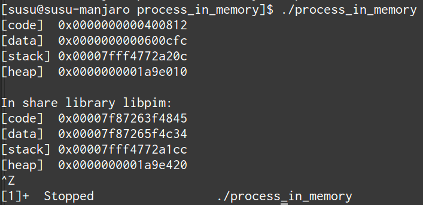

   **Figure 4. process_in_memory output**

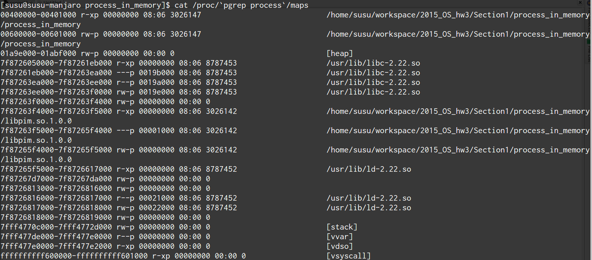

   **Figure 5. process_in_memory procfs**

The evaluation is like Figure 4 and Figure 5.

We can found the program print variable address ``0x600cfc`` in data segment, and procfs shows that ``0x600000`` to ``0x601000`` is the virtual address range of data segment. We verify that pointer is match to procfs memory map.

In the same way, we can found executable and shared library's code/data/stack/heap segment location in procfs map.

Printing code segment is using a technique named inline assembly. 
Use it to running x86 assembly code in C code to print processor's program counter register (register ``rip`` in x86_64).

D. [Supplement] How to build a shared library
~~~~~~~~~~~~~~~~~~~~~~~~~~~~~~~~~~~~~~~~~~~~~

Reference [2]_ is our good friend. :)

Section 2. Adding a new Linux system call
---------------------------------------------------

Modern operating systems such as Windows and Linux are structured into two spaces: user space and kernel space.
Most of the operating system functions are implemented in the kernel.
Programs in the user space have to use appropriate system calls to invoke the corresponding kernel functions.
In this homework, we will take a closer look at the system call mechanism by tracing system calls made by a user process calls.
We will then demonstrate how to implement a new system call on Ubuntu Linux.

A. Use ``strace`` to trace the system calls made by the ``ls`` command
~~~~~~~~~~~~~~~~~~~~~~~~~~~~~~~~~~~~~~~~~~~~~~~~~~~~~~~~~~~~~~~~~~~~~~

1. Use ``strace``::

   $ strace ls 2>& strace.txt

2. Open/Cat the output file ``strace.txt`` (e.g. Figure 6)

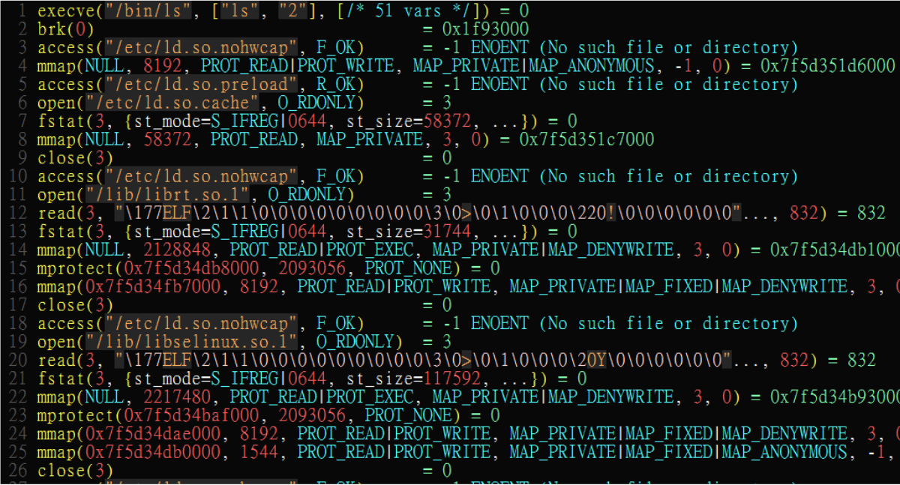

   **Figure 6. screenshot of strace command**

3. You can see all the system calls made by the ls command in sequential order.
   For instance, in Figure 6, we can see that the ls command has invoked the execve, brk, access, and mmap system calls.

B. Add a custom system call
~~~~~~~~~~~~~~~~~~~~~~~~~~~

1. Download the kernel source
"""""""""""""""""""""""""""""

A. find the kernel version::

      $ uname -r
      3.19.0-25-generic
      # 3.19.0 is origin linux kernel version, 25 is version of ubuntu 14.04.3's distrbution patch to linux 3.19.0

B. download kernel source

   In this homework, we use vanilla linux kernel instead of distribution kernels for simplicity.
   The vanilla Linux kernel can be downloaded from (``kernel.org``).

   ``kernel.org`` website

        .. figure:: pic/kernel_org.png
           :scale: 50%

           Figure 7.

   - Go to location to download from HTTP 

        .. figure:: pic/kernel_org_http.png
           :scale: 50%

           Figure 8.

   - Go to ``linux/kernel/v3.0``
   - find ``3.19.tar`` in website

        .. figure:: pic/kernel_319.png
           :scale: 50%

           Figure 9.

   - download ``tar.gz`` or ``tar.xz`` (they are only different in terms of compression formats)
   - Decompress and unpack::

        $ tar -xvf linux-3.19.tar.gz
        # This will decompress and unpack kernel source to directory linux-3.19/ at current working directory.

2. Adding custom system call
""""""""""""""""""""""""""""""""""""
   
A. Define the custom system call in the syscall table (see Figure 10)::

   $ vim [source code directory]/arch/x86/syscalls/syscall_64.tbl

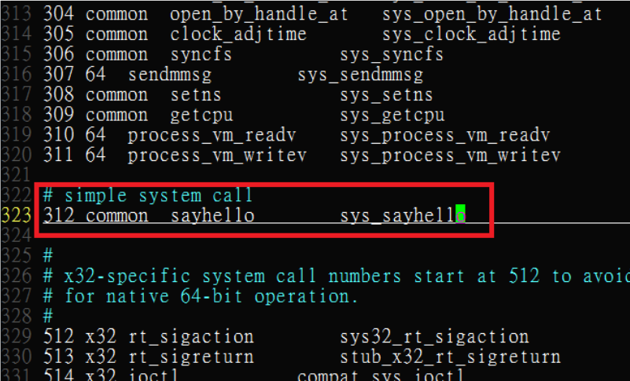
  
   **Figure 10. add a system call ‘sayhello’ to syscall table**

B. Add the system call function prototype to the syscall interface (see Figure 11)::

   $ vim [source code directory]/include/linux/syscalls.h
   
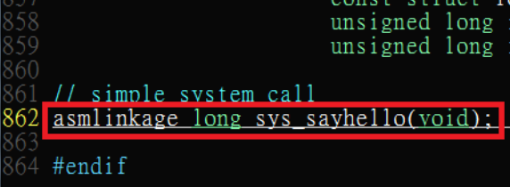

   **Figure 11. add the system call ‘sayhello’ function prototype to the syscall interface**

C. Implement the custom system call function definition (see Figure 12)::

   $ vim [source code directory]/kernel/sayhello.c

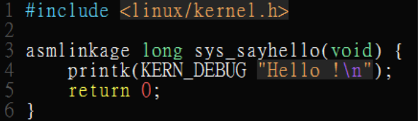
  
   **Figure 12. Implementation of the system call ‘sayhello’**

D. Include the custom system call into kernel build steps (e.g. Figure 13)::

   $ vim [source code directory]/kernel/Makefile

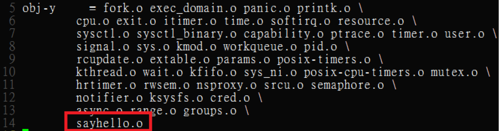

   **Figure 13. Include the custom system call module in the kernel Makefile**

E. [IMPORTANT] Give the new kernel a unique name, for making follow-up installation steps easier (see Figure 14.)::

   $ vim [source code directory]/Makefile

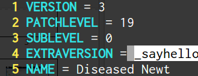

   **Figure 14. modify kernel extra version to give patched kernel unique name**

Adding a patch to linux kernel source is something like adding a patch to general C project.
To add new function ``sayhello`` into C project, we need to add function prototype in the header file(``syscall.h``) and function definition in the C source file(``sayhello.c``).
To add new C source file ``sayhello.c`` into C project, we sometimes need to modify project build system config(``Makefile``) to add this c file.
Only a syscall table is the design we rarely found in general C project.

3. build and install new kernel
"""""""""""""""""""""""""""""""

A. clean project config file and building object(result and intermidiate executables and object codes)::

      $ make mrproper clean

      # ``make mrproper clean`` means ``make mrproper``, then ``make clean``. 
      # ``make clean all`` or others are also using this rule.

B. generate build config file (at ``.config``) of linux kernel source code. we use x86 default config here::

      $ make x86_64_defconfig

C. build linux kernel executable, kernel image and linux kernel modules::

      $ make vmlinux bzimage modules
      # build kernel executable at vmlinux
      # build kernel image at arch/x86/boot/bzImage
      # build kernel modules at module's local directories

      # or you can use multiprocess for faster parallel build
      # using 4 process for example
      $ make -j4 vmlinux bzimage modules

D. install kernel and kernel modules, and modify grub to add boot option of new kernel::

      $ sudo make modules_install install
      # install kernel module at /lib/modules/3.19.0_sayhello
      # install kernel at /boot/vmlinuz-3.19.0_sayhello
      # with initramfs, kernel config, memtest, and System tap at /boot/
      # add 3.19.0_sayhello kernel at boot option by modifying /boot/grub/grub.cfg

E. setting boot option non-hidden and wait for 10 sec::

      # add comments to GRUB_HIDDEN_TIMEOUT=0 at /etc/default/grub. see figure 15
      $ sudo vim /etc/default/grub

      # apply update to /boot/grub/grub.cfg
      $ sudo update-grub

   .. figure:: pic/grub_hidden_menu.png
      :scale: 75%

      **Figure 15. close grub hidden menu**

Every time you modify the kernel source (fix bug or ... etc), you can just repeat step C ~ E for building new kernel.
You do not need to run ``make clean`` if you just modify few code of kernel source without modifying ``Makefile``. You build it faster.
Otherwise, if you modify ``Makefile`` after running ``make clean``, please re-run ``make clean`` to remove the previous build object files.

run ``make help`` will help you learn more about make options of linux kernel source.

4. reboot and running new kernel
""""""""""""""""""""""""""""""""

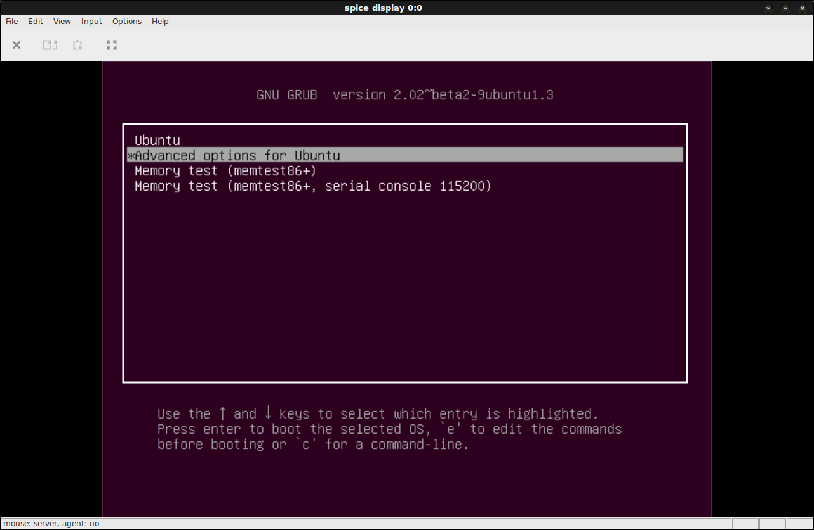

   **Figure 16. grub boot menu**

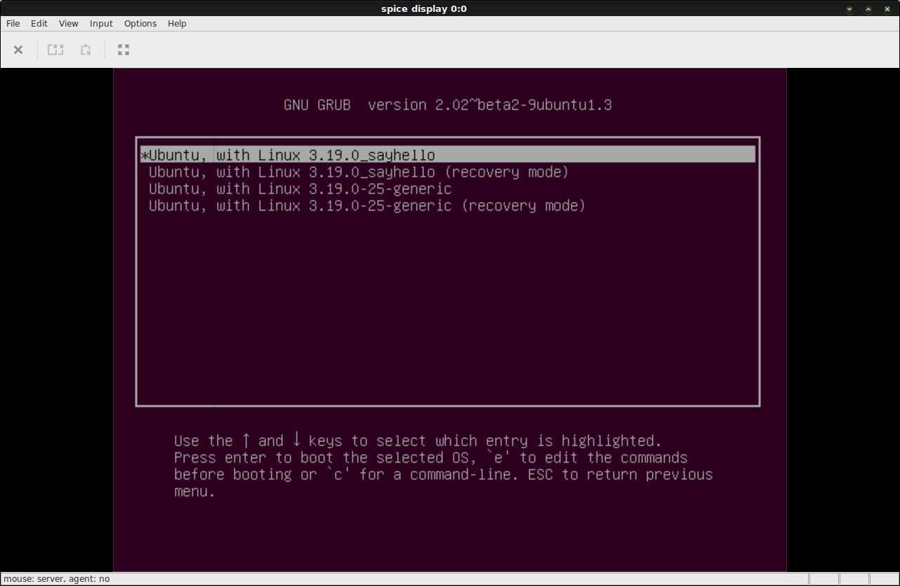

   **Figure 17. grub boot menu**

C. Invoke system call by the system call number (see Figure 18)
~~~~~~~~~~~~~~~~~~~~~~~~~~~~~~~~~~~~~~~~~~~~~~~~~~~~~~~~~~~~~~~

1. Include the following header files::
   
    #include <unistd.h>
    #include <sys/syscall.h>
   
2. Use function 'syscall' to invoke system call::

    Usage: syscall(int [syscall number], [parameters to syscall])

   .. figure:: pic/use_syscall.png
      :scale: 75%

      **Figure 18. invoke a system call in a program**

   
   For detailed information of syscall, please check Linux man pages::

      $ man syscall

3. After running the code, you can use ``dmesg`` to see the messages output from printk (e.g. Figure 19)::

    $ dmesg

   .. figure:: pic/dmesg_log_syscall.png
      :scale: 75%

      **Figure 19. the ‘printk’ messages from ‘sayhello’ system call**

Section 3. x86_64 Page Table Structure and Address Translation
--------------------------------------------------------------

When using virtual memory, every process will have its own memory space.
For example in Figure 20, the address 0x400254 in process A is pointed to physical address 0x100000 but in process B address 0x400254 may be pointed to physical address 0x300000.

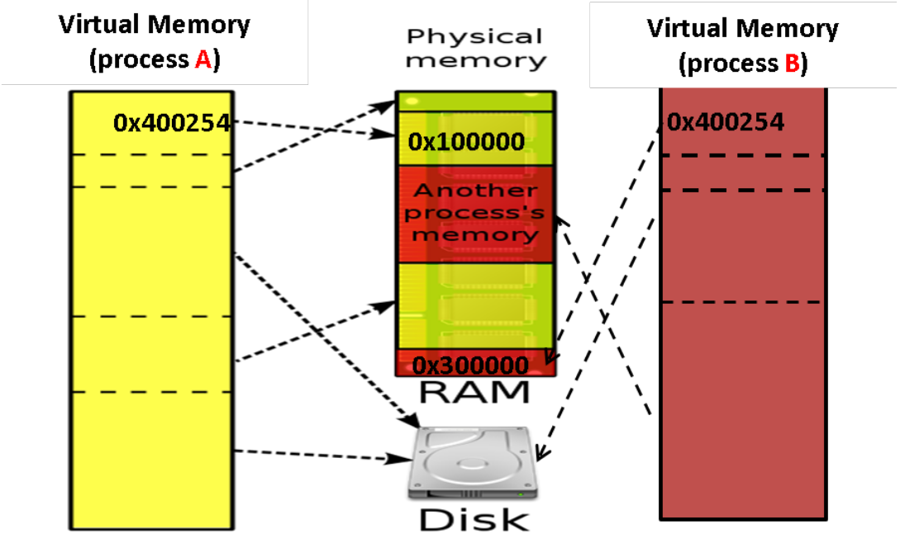

   **Figure 20. Virtual Memory(Modified from Wikipedia)**

A.  x86_64 Page Table Structure
~~~~~~~~~~~~~~~~~~~~~~~~~~~~~~~

We will demonstrate how a virtual address is translated into a physical address on x86_64 architecture with 4KB pages.

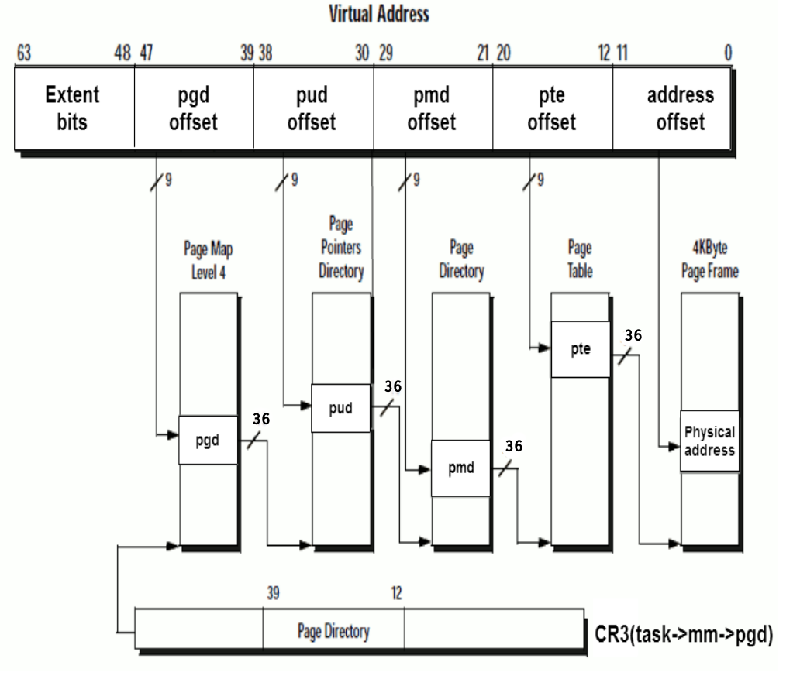

   **Figure 21. 64 bits page table overview**

Figure 21 is the page table structure on x86_64.
You can see that there are 4 levels of address translation.
Figure 22 shows how a virtual address gets converted to the physical address.
(Note. 
You can observe that there are 9 bits for each offset(except address offset). 
This means that there are 512(2^9) entries in one page table (Because each page is 4K bytes, that means each page table entry is 64 bits).

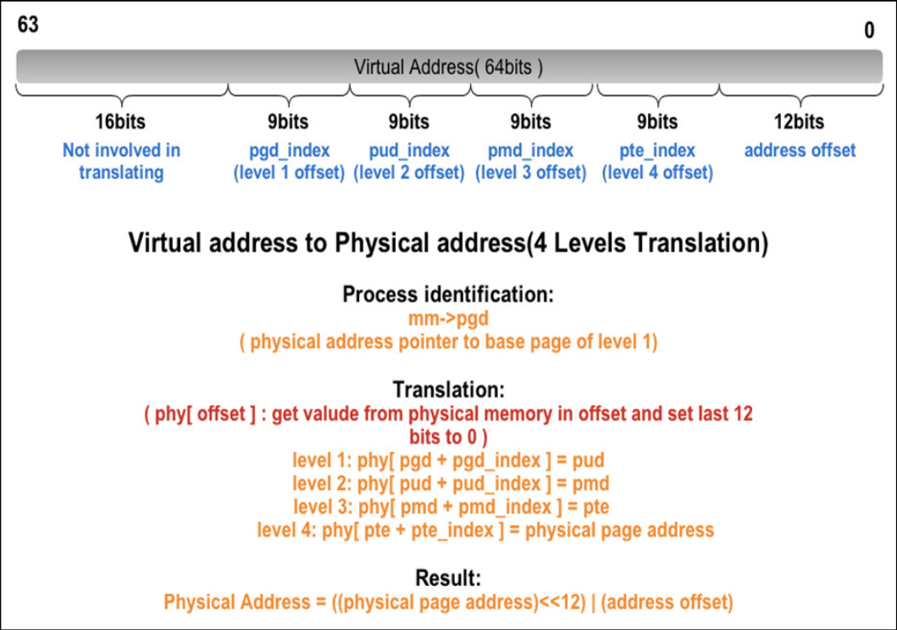

   **Figure 22. Virtual address to physical address**

B. Super Page (2M sized pages)
~~~~~~~~~~~~~~~~~~~~~~~~~~~~~~

Not all memory pages are 4K in size.
For instance, the system_call_table is placed on a 2M page, and a 2M page is often referred to as a super page (as opposed to a 4KB small page).
How can we locate a 2M page? It is almost the same as locating a 4k page except that we only need to walk 3 levels of page tables to locate a 2M page.
There is no need for the 4th level page table in locating the physical address of a 2MB page, and we can say that the PMD is in fact the PTE for 2MB pages.
Linux kernel uses the ``int pmd_large(pmd_t *pmd)`` function to determine if a PMD points to the 2M page.
If pmd_large() return 0, it means that the page is not a PTE for a 2M page so you will have to walk theforth level page table;
otherwise, the PMD is the last level of page table of a 2MB page.

C. Address translation functions in Linux kernel
~~~~~~~~~~~~~~~~~~~~~~~~~~~~~~~~~~~~~~~~~~~~~~~~

Linux kernel has some useful functions and structures (defined in ``arch/x86/include/asm/pgtable.h``) to help translate virtual address to physical address.

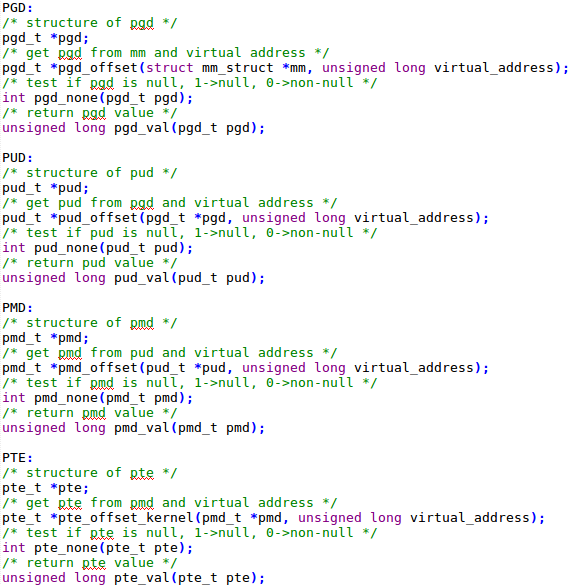

   **Figure 23. Functions of address translation in Linux**

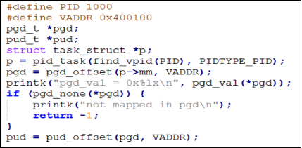
   
   **Figure 24. Example of address translation**

Figure 24 is an example of how to lookup the first level page table. 
The rest of translation is pretty much the same.

You can finish the HW with only Section 3 message.

Also, you can trace Linux kernel to understand these structures and functions more.
LXR [8]_ is our good friend to trace linux kernel. See Appendix A. for example.

Section 4. [Assignment] Adding an address translation system call and observing copy-on-write and page sharing
-------------------------------------------------------------------------------------------------

Part A. add an address translation system call and confirm it with child process forking and memory copy-on-write.
~~~~~~~~~~~~~~~~~~~~~~~~~~~~~~~~~~~~~~~~~~~~~~~~~~~~~~~~~~~~~~~~~~~~~~~~~~~~~~~~~~~~~~~
NOTE: For all example code, please modify system call number(Macro ``SYSCALL_NUM_LOOKUP_PADDR``) to match the actual system  call number you used for the custom system call in the system call table.

You’ve learned in the class that the fork system call can be used to create a child process.
In essence, the fork system call creates a separate address space for the child process.
The child process has an exact copy of all the memory segments of the parent process.
The copying is obviously a time consuming process.
As a result, to reduce the overhead of memory copying, most fork implementation (including the one in Linux kernel) adopts the so-called copy-on-write strategy.
The memory pages of the child process are initially mapped to the same physical frames of the parent process.
Only when a child process memory page is about to be overwritten, will a new physical copy of that be created, so the modification on that page by one process will not be seen by the other process.

In Part A, you need to implment the address translation system call that translates a virtual address to the corresponding physical address. Then, 
you need to observe the copy-on-write behavior of fork system call and check if your address translation system call is working properly.

For the address translation system call, it should take two inputs, which are ``pid`` (process id) and a ``virtual address``. The output is the corresponding physical address.
A template (named ``PartA_kernel_patch/lookup_paddr.c``) will help you complete the task.
You just need to add the necessary code in it, integrate the template file into the kernel source, and rebuild the kernel.
You can then test the effect of the system call following the same steps in Section 2.

``PartA_user_test_program/basic_fork_ex.c`` is the user-level test program that you will use for testing your system call. To verify the correctness of the address translation system call, the program will allocate a variable ``mem_alloc`` on the heap. It will then use fork to create a child process and modify the value of the variable. 

You should observation something like Figure 25.

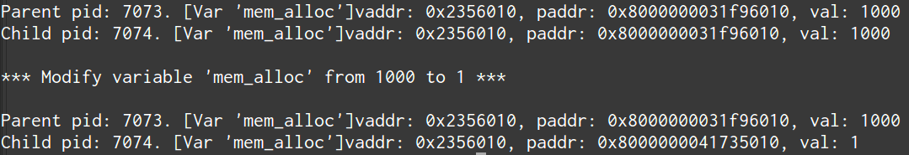
    
   **Figure 25. basic fork example for CoW strategy**

The virtual addresses for the variable ``mem_alloc`` are identical in the parent process and in the child process. This is expected as fork will create a copy of the parent memory content for the child. The physical addresses are the same as well, which indicate that the underying memory pages are shared (so the copy is actually a 'logical copy'). However, after the child modifies the value of the variable ``mem_alloc``, we can see that the memory pages of the parent and the child processes bear different values, and more importantly, the physical addresses for ``mem_alloc`` are now different.
However, their virtual addresses are still the same.

Part B. copy-on-write in stack and heap segment, CoW per page
~~~~~~~~~~~~~~~~~~~~~~~~~~~~~~~~~~~~~~~~~~~~~~~~~~~~~~~~~~~~~

Then, we want to observe CoW strategy more clearly. Trying to observe memory CoW of each page individually, and CoW in each segment individually.

In Part B, you are asked to write a program to verify memory CoW of stack and heap segment of fork system call.
In the example program, we need to seen 4 writing operations to variable after process forking.
each of 2 writing operations makes a single page copy in stack, and each of another 2 writing operations makes it in heap.

A template (named ``stack_and_heap.c``) will help you complete the task.

The expected evaluation is like Figure 26 ~ 28. Heap buffer1 and buffer2 are both similar.

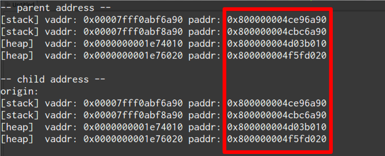

   **Figure 26. child use same physical page as parent**

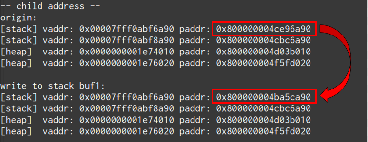

   **Figure 27. simply copy stack buffer1. stack buffer2 and heap buffer are also shared pages.**

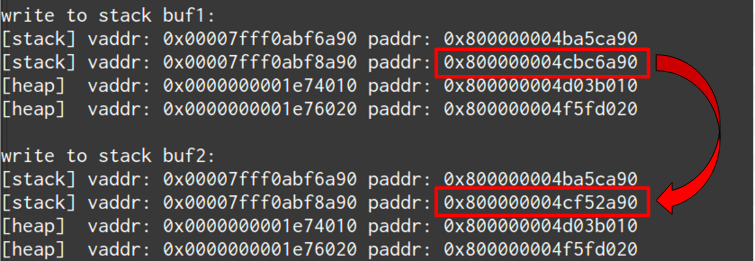

   **Figure 28. simply copy stack buffer2.**

Part C. shared library
~~~~~~~~~~~~~~~~~~~~~~

At last, instead of CoW strategy, we will observe the sharing of shared library.
We both know a sharing library in the memory can be divided to code and data segment, only the code segment is always shared.

To verify it, you are asked to write a program with a handmake shared library (Section 1). 
This program do a fork and write to shared library data segment, then printing physical address of shared library's code and data segment for both parent and child process.
Then we'll found same physical address in code segment and different physical address in data segment.

There isn't a template in this part. 

You can use Section 1 example (``process_in_memory``) as basement, and use the experience in Section 4 Part A, B (address translation system call) to finish this part by yourself.

The expected evaluation is like Figure 29.

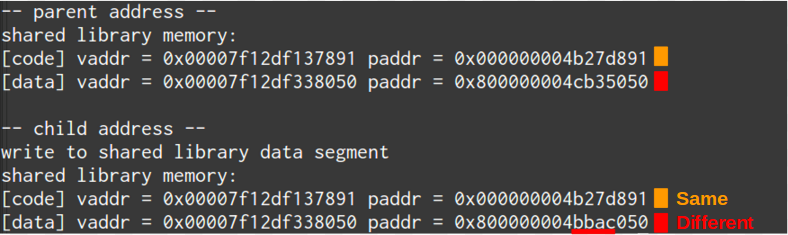

   **Figure 29. shared library only shared code segment if the program write to all memory pages in data segment**

Grading Policy
--------------
- Section 4

  - Part A. 70%
  - Part B. 20%
  - Part C. 10%

Deliverable
-----------
- Section 4

  - Part A. ``lookup_paddr.c``
  - Part B. ``stack_and_heap.c``
  - Part C. ``shared_library/`` directory

    - A **Makefile**. You can use an example one.
    - Source files that compile, by typing ``make``, into an executable ``shared_library_test`` and dependent shared library ``libslt.so.1.0.0``.
    - Optionally, a file of name ``README`` that contains anything you wish to point out to us.

- Put all the files/directories in ``HW3_<STUDENT ID>/``, compress it to ``HW3_<STUDENT ID>.zip``, and upload it to e-campus.

Contact Us
----------
If you have any question about this homework, feel free to e-mail the TA, or knock the door of EC618.

- TA: 舒俊維 (Chun-Wei Shu)
- E-mail: u1240976.cs04g@nctu.edu.tw

Don't forget to attach your **name** and **student ID** in the e-mail, and name the subject as ``[OS] HW3 Question (<STUDENT ID>).``

Appendix A. Using LXR to help us tracing Linux Kernel
-----------------------------------------------------

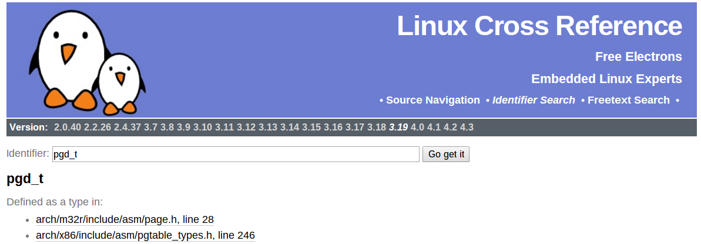

   **Figure 30. LXR identifier search pgd_t**

- Source Code Navigation: just a linux kernel repository, read source code in web.
- Identifier Search: search variable name, function name, macro in linux kernel source code.
- choose linux kernel version, all minor version [9]_ after linux kernel 3.7 is available, we use 3.19.0 this time.

We'll search ``struct pgd_t`` for example. See Figure 30 first.

Because page table structure is processor-dependent(archtecture-dependent), we found many processor's code in our search. (m32r, x86, arm, mips, avr32 ... etc)

Our platform is x86_64, so we read x86 processor's code.

We found ``pgd_t`` is a struct of one member with ``pgdval_t`` type.::

   typedef struct { pgdval_t pgd; } pgd_t;

Then, we'll find what is ``pgdval_t``. To search ``pgdval_t``, we'll find 3 files related to x86. (Figure 31)

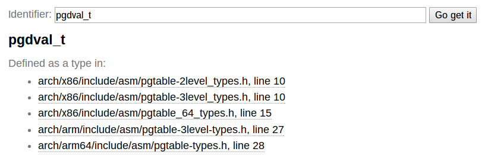

   **Figure 31. LXR identifier search pgdval_t**

No matter which file we use in x86_64, we can observe 3 file definition first.::

    typedef unsigned long   pgdval_t; // pgtable-2level_types.h
    typedef u64             pgdval_t; // pgtable-3level_types.h
    typedef unsigned long   pgdval_t; // pgtable_64_types.h

``u64`` is fixed sized integer macro in linux kernel, simply means 64 bits unsigned integer.

x86_64 in Unix-like platform (e.g. Linux) use LP64 data model [10]_, which means ``unsigned long`` is 64 bits integer.

Thus, in three definitions, ``pgdval_t`` are all simply a 64 bits unsigned integer.

We know that ``pgd_t`` is simply a 64 bits unsigned integer in a ``struct``.
In reality, linux kernel usually use ``pgd_t`` type variable to store value of 1st level page table entry (entry is also 64 bits, see Section 3. Part A). ``pgd_value()`` will return this entry's value in ``unsigned long`` type.
``pud_t``, ``pmd_t``, ``pte_t`` is similar to ``pgd_t``.

To trace the ``*_offset()`` function like this way, you may found that offset function just does the work of getting entry value, doing bitwise operation, and using pointer deference to get next level entry value.

4 level translation operation is similar to doing 4 times of pointer deferencing.

If you are curious about 3 definition of ``pgdval_t`` in x86 platform, please see reference [11]_.

Reference
---------
.. [1] Another way for library is to have an entry point, but an entry point is shadowed when it is used as a library.
       The entry point is used when it is run as a standalone program. 

       That is, this library is both a library and a standalone program simultaneously.

       In binary level, position independent executable use this concept.

       In high level programming language, python's feature ``if __name__ == "__main__":`` use this concept.

.. [2] static, shared, and dynamic loaded library.

       Shared library can be really dynamic loaded by dl-series function, without compile time hinting.

       `[LinuxDev] cole945 [心得] 用 gcc 自製 Library <https://www.ptt.cc/bbs/LinuxDev/M.1162669989.A.2E6.html>`_

.. [3] However, not just for shared libraries, every ``mmap`` system call without assigning mapping address will use this segment.

       e.g. memory allocation (``malloc``) with size larger than ``M_MMAP_THRESHOLD`` will use this segments instead of heap, in the current glibc ``malloc`` implementation. 

       see `man mmap <http://man7.org/linux/man-pages/man2/mmap.2.html>`_, `man mallopt <http://man7.org/linux/man-pages/man3/mallopt.3.html>`_ for more infomation.

.. [4] linux device number

       ch2.2 device number of `link <http://tldp.org/HOWTO/Partition/devices.html>`_
       
.. [5] C standard library functions in <math.h> is the only exception, their implemenation is at libc.so.

.. [6] `man ld.so <http://man7.org/linux/man-pages/man8/ld.so.8.html>`_

.. [7] `man vdso <http://man7.org/linux/man-pages/man7/vdso.7.html>`_

.. [8] `lxr <http://lxr.free-electrons.com/>`_

.. [9] Program Version Numbering. X.Y.Z (MAJOR.MINOR.PATCH) is one common style of it. Three number has different meaning to software API compatibility.

       For more infomation, see the link `semantic version <http://semver.org/>`_.

.. [10] 64 bits data models: https://en.wikipedia.org/wiki/64-bit_computing#64-bit_data_models
       
        Data model is important concept because it may be the only way to know the size of non-fixed sized integer(tranditional integer) in C.

        Integer size in C/C++ is an annoying topic. The following link gives some info `一個長整數各自表述 (in 64-bit system) <http://dada.tw/2008/04/18/85/>`_

.. [11] 4 layer translation in Linux Kernel for x86, x86+PAE, x86_64 architecture: https://lwn.net/Articles/117749/ 
