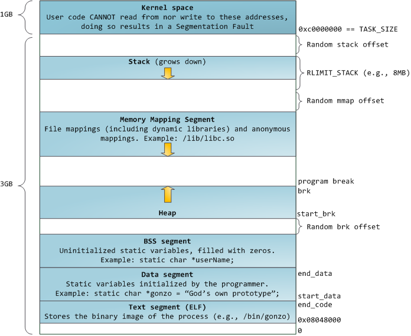

HW3 Virtual Memory Experiment
=============================

Overview
--------
In this homework, we will do two experiments to observe the memory sharing mechanisms in Linux OS, to make us be more familiar with Virtual Memory System.
Two experiments are memory CoW mechanism after process forking and the memory sharing of shared libraries.

To do these experiment, you should obtain kernel information, like physical memory address of our process, to check if two processes use same phyical memory page(frame).
Thus we need to implement a system call in linux kernel to translate process's virtual address to physical address, and pass through it to user space.
Then, you will write a test program to confirm the memory CoW(Copy-on-Write) mechanism. Processes can print variable pointer to 
get virtual memory address, we can use procfs to get process memory layout for knowing which segment these variable belongs to, and then use physical memory address to check if two processes shared same physical page.

In Section 1, we will tell about how to get process memory layout in Linux by procfs, and printing the variable pointer value in C program to observe the relation between each other. We also discuss the condition of shared libraries, so we'll handcraft a simple shared library.

In Section 2, we will give you a guide for how to add a system call in linux kernel.

In Section 3, we will show you how address translation take place in x86_64 linux kernel.

note: If you know how to do it, you can jump to Part D for homework requirement and example code.

Section 1. Process Memory Layout
--------------------------------
- outline 

  - Process in Memory & C pointer
  - Process in Memory in Linux

    - shared library
    - procfs 

  - example

    - inline assembly

In part A, we will discuss about how process use memory, and give some tools to observe it.

In the theoretical memory layout, we know the memory of our process is divided into 4 parts. 

1. Code segment, which consist of all functions in the program except shared libraries.
2. Data segment, which stores global and static variables except shared libraries.
3. Stack segment, which stores local variables including function parameters. It is also named call stack.
4. Heap segment, which is used for dynamic memory allocation(malloc/free).

In current linux implemetation(Linux 3.x & 4.x), each segment should be contiguous memory, and must be consist of numbers of memory pages.
Also linux has more segments than theoretical memory layout, we will discuss it later.

In this memory layout, code is seperate from data for different purpose and permission(e.g. Data Execution Prevention).
3 segment of data memory is divided for different lifetime requirement(we can also think it as memory/resource allocation issue).

1. Data segment is from program start to program end. It's size is decided at compile time.
2. Stack segment is from function call to function return. Stack allocation is dynamic, but more restrict and faster than heap allocation.
3. Heap segment is from malloc library call to free library call. Heap allocation is the most flexible dynamic allocation with relatively high overhead.

By knowing the memory layout and lifetime, we can know why we won't return pointer of local variable in C function, understand the precise time when variable's destructor is driven in C++. 
Moreover, it is the basement knowledge to understand and make good use of some advanced language features, like C++11 rvalue reference, C++11 smart pointer and Rust ownership type system. 

Then, give an example of C pointer and memory segment.

::

   .. image:: pointer in c and memory segment

The image below is the virtual memory layout of process in 32 bits Linux system. To explain this, we should talk about an important concept, shared library first.

The library is a set of functions which doesn't have entry point(e.g. main function). [6]
In other words, all of object code except one having main function can be seemed as a library. 
Some of libraries you use will be linked into executable at end of compilation time(more precisely, link time).
That is called static library.
Different from static library, The shared library isn't linked into executable at compile time.
Shared library would be marked into executable at compile time(more precisely, link time), and loading at runtime. [7]

Because shared libraries are indepedent and seperated from executable, they are easily shared in memory if different process use same libraries. That is why they are called "shared" libraries.

Also because shared libraries are seperated from executable, they have independent code and data segment.

After introduction, we will start run simple program and observe the virtual memory layout of it.

1. compile and run the first program in C

   ::

     $ cd partA/
     $ make
     $ ./hello.out

2. get the process id of our program

   ::
    
     # dump the process snapshot(ps), and find the pid of our process (grep by process name)
     $ ps aux | grep hello

     # the shortcut command
     $ pgrep hello

3. find process virtual memory layout in the procfs

   ::

     $ cat /proc/<pid>/maps  # e.g. cat /proc/1234/maps

     # if the layout is more than one page, we can use less pager
     $ cat /proc/<pid>/maps | less

4. read it.

   Before reading it, segment and VMA(Virtual Memory Area)

    a. First, see process name. it is code and data segment of your program.
       Code and Data segment infomation are stored in executable file, which is ELF format in linux.
       It is memory mapped from executable file to memory, so the procfs show the name of executable in these VMAs.

       We can use permission to distinguish each other.
       Code segment has read and execute permission.
       Data segment has read and write permission.

       :: 

         00400000-00401000 r-xp 00000000 08:06 2490469                            /home/susu/workspace/2015_OS_hw3/partA/hello.out
         00600000-00601000 rw-p 00000000 08:06 2490469                            /home/susu/workspace/2015_OS_hw3/partA/hello.out

    b. Second, stack segment

       :: 

         7ffdf1c90000-7ffdf1cb1000 rw-p 00000000 00:00 0                          [stack]

    c. Third, shared libraries
    
       ::

         7fde68109000-7fde682a4000 r-xp 00000000 08:06 8787453                    /usr/lib/libc-2.22.so
         7fde682a4000-7fde684a3000 ---p 0019b000 08:06 8787453                    /usr/lib/libc-2.22.so
         7fde684a3000-7fde684a7000 r--p 0019a000 08:06 8787453                    /usr/lib/libc-2.22.so
         7fde684a7000-7fde684a9000 rw-p 0019e000 08:06 8787453                    /usr/lib/libc-2.22.so
         7fde684a9000-7fde684ad000 rw-p 00000000 00:00 0 
         7fde684ad000-7fde684cf000 r-xp 00000000 08:06 8787452                    /usr/lib/ld-2.22.so
         7fde68691000-7fde68694000 rw-p 00000000 00:00 0 
         7fde686cc000-7fde686ce000 rw-p 00000000 00:00 0 
         7fde686ce000-7fde686cf000 r--p 00021000 08:06 8787452                    /usr/lib/ld-2.22.so
         7fde686cf000-7fde686d0000 rw-p 00022000 08:06 8787452                    /usr/lib/ld-2.22.so

       libc.so is standard C library, consist of implementation of ``printf()``, ``fopen()``. [3]
       ld.so is the dynamic linker/loader, which help you to dynamic loading other shared libraries. [4]

       ``ldd`` can help you know the shared library dependency of executable.::

         # dependency of hello.out
         $ ldd hello.out
         # linux-vdso.so is about fast system call(int 0x80 is slow) in linux [5]

         # dependency of commands
         # executable path of command
         $ which ls
         # ldd <executable path of ls>
         $ ldd `which ls`

    d. Last, others, doesn't discuss in this HW

Then, run second program(sorting_number.out) with same step, you will observe heap.
The malloc size of second program is decided by arguments.::

    ./sorting_number [num] # malloc num*sizeof(int) byte

- tool

  - strace

::

    Process in the memory can be divided into 2 parts, code and data. 
    Code is the set of all functions in the program, each function is a set of instructions in the memory.
    Data can be still divided into 3 parts in theory, They are global and static variable, local variable, and dynamic memory allocation(malloc).

Section 2. Adding a new system call in Linux Kernel
---------------------------------------------------

Section 3. x86_64 Page Table Structure and Address Translation
--------------------------------------------------------------

Section 4. [Assignment] Adding a address translation system call and observe memory CoW technique
-------------------------------------------------------------------------------------------------

Part A. add a address translation system call and confirm it by basic fork-CoW example.
~~~~~~~~~~~~~~~~~~~~~~~~~~~~~~~~~~~~~~~~~~~~~~~~~~~~~~~~~~~~~~~~~~~~~~~~~~~~~~~~~~~~~~~

You’ve learned in the class that the fork system call can be used to create a child process.
In essence, the fork system call creates a separate address space for the child process.
The child process has an exact copy of all the memory segments of the parent process.
The copying is obviously a time consuming process.
As a result, to reduce the overhead of memory copying, most fork implementation (including the one in Linux kernel) adopts the so-called copy-on-write strategy.
The memory pages of the child process are initially mapped to the same physical frames of the parent process.
Only when a child process memory page is about to be overwritten, will a new physical copy of that be created, so the modification on that page by one process will not be seen by the other process.

In the Part A, you are asked to verify the copy-on-write behavior of fork system call.
Specifically, you need to complete one task.

    **Implement a custom system call to translate a virtual address to physical address.**

    You first need to implement a system call that translates a virtual address to the corresponding physical address.
    The inputs are ``pid`` (process id) and a ``virtual address``.
    A template (named ``lookup_paddr.c``) will help you complete the task.
    You just need to add the necessary code in it, integrate the template file into the kernel source, and rebuild the kernel.
    You can then test the effect of the system call following the same steps in Section 2.

    ``basic_fork_ex.c`` is testing code for this system call. You need to verify the correctness of system call by it.
    This example confirm that "fork" uses copy-on-write in the creation of child process address space, using heap segment as example.

    The expected evaluation is like Figure 1.

    .. figure:: pic/fork_ex_evalutation.png

    
       **Figure 1: basic fork example for CoW strategy**

    The virtual addresses of parent and child processes are initially the same. This is as expected.
    After the child modifies the value of the variable ``mem_alloc`` we can see that the memory pages of the parent and the child processes bear different values. 
    However, their virtual addresses are still the same.

Part B. copy-on-write in stack and heap segment, CoW per page
~~~~~~~~~~~~~~~~~~~~~~~~~~~~~~~~~~~~~~~~~~~~~~~~~~~~~~~~~~~~~

Then, we want to observe CoW strategy more clearly. Trying to observe memory CoW of each page individually, and CoW in each segment individually.

In Part B, you are asked to write a program to verify memory CoW of stack and heap segment of fork system call.
In the example program, we need to seen 4 writing operations to variable after process forking.
each of 2 writing operations makes a single page copy in stack, and each of another 2 writing operations makes it in heap.

A template (named ``stack_and_heap.c``) will help you complete the task.

The expected evaluation is like Figure 2 ~ 4. Heap buffer1 and buffer2 are both similar.

.. figure:: pic/stack_and_heap_evaluation1.png

    **Figure 2: child use same physical page as parent**

.. figure:: pic/stack_and_heap_evaluation2.png

    **Figure 3: simply copy stack buffer1. stack buffer2 and heap buffer is also a shared page.**

.. figure:: pic/stack_and_heap_evaluation3.png

    **Figure 4: simply copy stack buffer2.**

Part C. shared library
~~~~~~~~~~~~~~~~~~~~~~

At last, instead of CoW strategy, we will observe the sharing of shared library.
We both know a sharing library in the memory can be divided to code and data segment, only the code segment is always shared.

To verify it, you are asked to write a program with a handmake shared library (Section 1). 
This program do a fork and write to shared library data segment, then printing physical address of shared library's code and data segment for both parent and child process.
Then we'll found same physical address in code segment and different physical address in data segment.

There isn't a template in this part. 

Please use the experience in Section 1 example (shared library) and Section 4 Part A/B (address translation system call) to finish this part by yourself.

The expected evaluation is like Figure 5.

.. figure:: pic/shared_library_evaluation.png

    **Figure 5: shared library only shared code segment if the program write to all memory pages in data segment**

Section 5. project bonus
------------------------
- Question of Lab

  1. The pgd/pud/pmd/pte_index is address of page table entry or page table, which address space is the address use, virtual or physical?
  2. why stack1 var is CoW at start?

Grading Policy
--------------
- Section 4

  - Part A. 70%
  - Part B. 20%
  - Part C. 10%

Deliverable
-----------
- Section 4

  - Part A. ``lookup_paddr.c``
  - Part B. ``stack_and_heap.zip``
  - Part C. ``shared_library.zip``

Appendix A. How to build linux kernel
-------------------------------------
At first, we should download kernel source code to build. we can choose vanilla linux kernel or distribution kernel.
The former is more portable to different linux distro, the latter is more suitable to your distro.

1. kernel config
   
   - make menuconfig
   - generate .config

2. build kernel

   - make all
   - generate vmlinux, bzImage, and kernel modules

3. install kernel

   - move vmlinux to ``/boot/``
   - move kernel modules to ``/lib/modules/``
   - generate initramfs for new kernel(vmlinux)

4. bootloader configuration

   - modify grub menu(``/boot/grub/grub.cfg``) to add entry for new kernel & initramfs

Reference
---------
[1] Heap allocation: Thus, it has many different implementation considering time overhead and multithreading issue, like dlmalloc/ptmalloc2/jemalloc/tcmalloc (They are used in Linux, FreeBSD, Android, Firefox, and Chrome).

[2] static and shared library

[3] C standard library functions in <math.h> is the only exception, there implemenation is at libc.so.

[4] ``man ld.so``: http://man7.org/linux/man-pages/man8/ld.so.8.html

[5] ``man vdso``: http://man7.org/linux/man-pages/man7/vdso.7.html

[6] position independent executale

[7] static, shared, and dynamic linked library.

Contact Us
----------
If you have any question about this homework, feel free to e-mail the TA, or knock the door of EC618.

- TA:
- E-mail: 

Don't forget to attach your **name** and **student ID** in the e-mail, and name the subject as ``[OS] HW3 Question (<STUDENT ID>).``

Misc
----
- SOP: how to build linux kernel, how to add system call
- supplement

  - Linux kernel build system
  - Intel reference manual of page table entry (Volume 3A, 4.5 IA-32E PAGING, 4.1 & 4.2 for intro)

    - 4 layer translation in Linux Kernel for x86, x86+PAE, x86_64 arch: https://lwn.net/Articles/117749/ 

  - Linux Kernel Memory Management: http://www.cs.columbia.edu/~krj/os/lectures/L17-LinuxPaging.pdf
